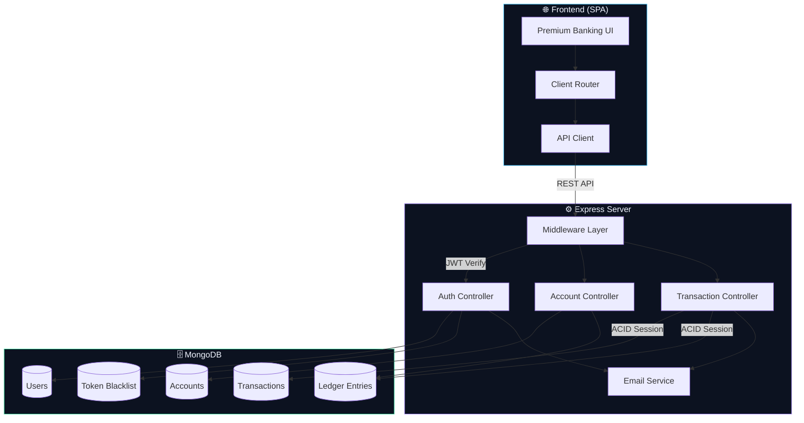
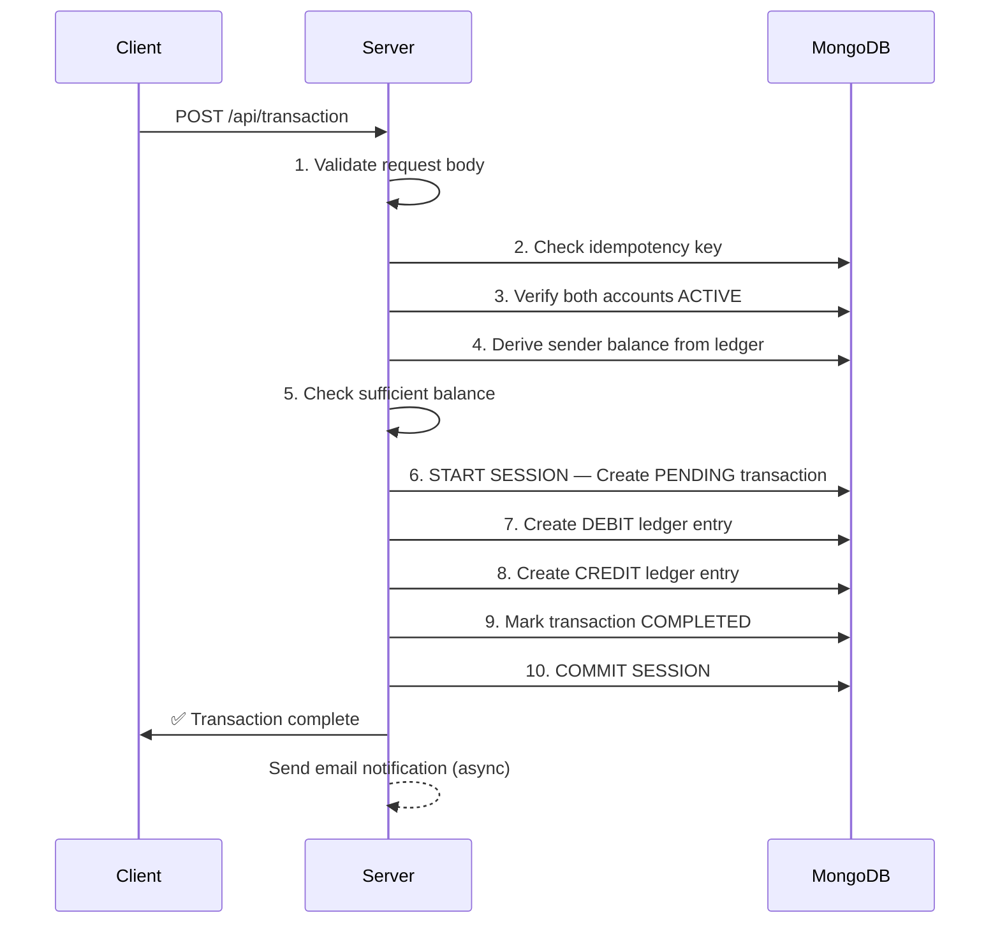

# 🏛 VaultCore

**A production-grade banking transaction system built with Node.js, Express, and MongoDB.**

VaultCore implements real-world banking patterns including double-entry ledger accounting, ACID-compliant transactions, idempotent transfers, JWT authentication with token blacklisting, and automated email notifications — designed to demonstrate fintech backend engineering at a professional level.

<p align="center">
  
  
  
  
</p>

---

## ✨ Features

| Feature | Description |
|---------|-------------|
| 🔐 **JWT Auth** | Register, login, logout with httpOnly cookies and token blacklisting |
| 📒 **Double-Entry Ledger** | Every transfer creates matching DEBIT and CREDIT entries — immutable audit trail |
| ⚡ **ACID Transactions** | MongoDB sessions ensure transfers complete fully or roll back entirely |
| 🔁 **Idempotent Transfers** | Unique idempotency keys prevent duplicate transactions on retries |
| 📧 **Email Notifications** | Gmail OAuth2-based alerts for registration and transactions via Nodemailer |
| 🏦 **Multi-Account** | Users can create and manage multiple bank accounts with independent balances |
| 👑 **System User** | Privileged admin role for initial fund injection into accounts |
| 🌐 **Full-Stack** | Premium dark-mode SPA frontend served from the same Express server |
| 🚀 **Vercel Ready** | Single-project deployment — backend API + frontend via one serverless function |

---

## 🏗 Architecture



### Transaction Flow (10-Step Process)



---

## 📁 Project Structure

```
VaultCore/
├── public/                         # Frontend SPA
│   ├── index.html                  # HTML shell
│   ├── css/styles.css              # Design system
│   └── js/
│       ├── api.js                  # REST API client
│       ├── app.js                  # SPA router & state
│       └── components.js           # UI renderers
├── src/                            # Backend
│   ├── app.js                      # Express app setup
│   ├── config/db.js                # MongoDB connection
│   ├── controllers/
│   │   ├── auth.controller.js      # Register, login, logout
│   │   ├── account.controller.js   # Account CRUD
│   │   └── transaction.controller.js # Transfer + initial funds
│   ├── middleware/
│   │   └── auth.middleware.js      # JWT + system user auth
│   ├── models/
│   │   ├── user.model.js           # User schema + bcrypt
│   │   ├── account.model.js        # Account + balance aggregation
│   │   ├── transaction.model.js    # Transaction states
│   │   ├── ledger.model.js         # Immutable ledger entries
│   │   └── blackList.model.js      # Token blacklist (TTL index)
│   ├── routes/
│   │   ├── auth.routes.js
│   │   ├── account.routes.js
│   │   └── transaction.routes.js
│   └── services/
│       └── email.service.js        # Nodemailer + Gmail OAuth2
├── api/index.js                    # Vercel serverless entry
├── vercel.json                     # Vercel deployment config
├── server.js                       # Local dev entry
├── .env.example                    # Environment template
└── package.json
```

---

## 📡 API Reference

### Authentication

| Method | Endpoint | Description | Auth |
|--------|----------|-------------|------|
| `POST` | `/api/auth/register` | Create a new user account | ✕ |
| `POST` | `/api/auth/login` | Sign in and receive JWT | ✕ |
| `POST` | `/api/auth/logout` | Blacklist token and sign out | ✕ |

### Accounts

| Method | Endpoint | Description | Auth |
|--------|----------|-------------|------|
| `POST` | `/api/accounts` | Create a new bank account | ✓ |
| `GET` | `/api/accounts` | List all user accounts | ✓ |
| `GET` | `/api/accounts/balance/:id` | Get account balance | ✓ |

### Transactions

| Method | Endpoint | Description | Auth |
|--------|----------|-------------|------|
| `POST` | `/api/transaction` | Create a new transfer | ✓ |
| `POST` | `/api/transaction/system/initial-funds` | Inject initial funds (system user only) | ✓ (System) |

### Request/Response Examples

<details>
<summary><b>POST /api/auth/register</b></summary>

```json
// Request
{
    "name": "John Doe",
    "email": "john@example.com",
    "password": "secure123"
}

// Response (201)
{
    "user": {
        "_id": "665a1b2c3d4e5f6a7b8c9d0e",
        "email": "john@example.com",
        "name": "John Doe"
    },
    "token": "eyJhbGciOiJIUzI1NiIs..."
}
```
</details>

<details>
<summary><b>POST /api/transaction</b></summary>

```json
// Request
{
    "fromAccount": "665a1b2c3d4e5f6a7b8c9d0e",
    "toAccount": "665a1b2c3d4e5f6a7b8c9d0f",
    "amount": 500,
    "idempotencyKey": "txn_unique_key_001"
}

// Response (200)
{
    "message": "transaction completed successfully",
    "transaction": {
        "_id": "665a1b2c3d4e5f6a7b8c9d10",
        "fromAccount": "665a1b2c3d4e5f6a7b8c9d0e",
        "toAccount": "665a1b2c3d4e5f6a7b8c9d0f",
        "amount": 500,
        "status": "COMPLETED",
        "idempotencyKey": "txn_unique_key_001"
    }
}
```
</details>

---

## 🚀 Getting Started

### Prerequisites

- **Node.js** v18+
- **MongoDB Atlas** cluster (or local MongoDB with replica set for transactions)
- **Gmail Account** with OAuth2 credentials (for email notifications)

### 1. Clone & Install

```bash
git clone https://github.com/yourusername/VaultCore.git
cd VaultCore
npm install
```

### 2. Configure Environment

```bash
cp .env.example .env
# Edit .env with your actual credentials
```

| Variable | Description |
|----------|-------------|
| `MONGO_URI` | MongoDB Atlas connection string |
| `JWT_SECRET` | Random 256-bit hex string for signing tokens |
| `CLIENT_ID` | Google OAuth2 client ID |
| `CLIENT_SECRET` | Google OAuth2 client secret |
| `REFRESH_TOKEN` | Google OAuth2 refresh token |
| `EMAIL_USER` | Gmail address for sending emails |
| `PORT` | Server port (default: 3000) |

### 3. Run Locally

```bash
npm run dev
```

Open [http://localhost:3000](http://localhost:3000) — both the API and frontend are served from the same server.

### 4. Deploy to Vercel

```bash
npm i -g vercel
vercel --prod
```

Set your environment variables in the Vercel dashboard under **Settings → Environment Variables**.

---

## 🔐 Security Features

- **bcrypt** password hashing (10 salt rounds)
- **JWT** with 3-day expiration and httpOnly cookies
- **Token blacklisting** with TTL-based auto-cleanup (3 days)
- **Input validation** on all endpoints
- **CORS** with credential support
- **Immutable ledger** entries (pre-hooks prevent modification/deletion)
- **System user** role separation for privileged operations

---

## 🧠 Design Decisions

### Why Double-Entry Ledger?
Instead of storing a `balance` field on each account, VaultCore derives the balance by aggregating all ledger entries (credits - debits). This is how real banking systems work — it provides a complete, immutable audit trail and makes balance tampering impossible.

### Why Idempotency Keys?
Network failures, timeouts, and retries can cause duplicate transaction submissions. The idempotency key ensures that even if a client submits the same transfer twice, it will only be processed once.

### Why MongoDB Sessions?
A single transfer touches 3 collections (transactions, 2 ledger entries). MongoDB ACID sessions ensure either all writes succeed or all roll back — preventing partial transfers that would create accounting discrepancies.

---

## 📄 License

MIT License — see [LICENSE](LICENSE) for details.

---

<p align="center">
    <sub>Built with ❤️ for learning fintech backend engineering</sub>
</p>
